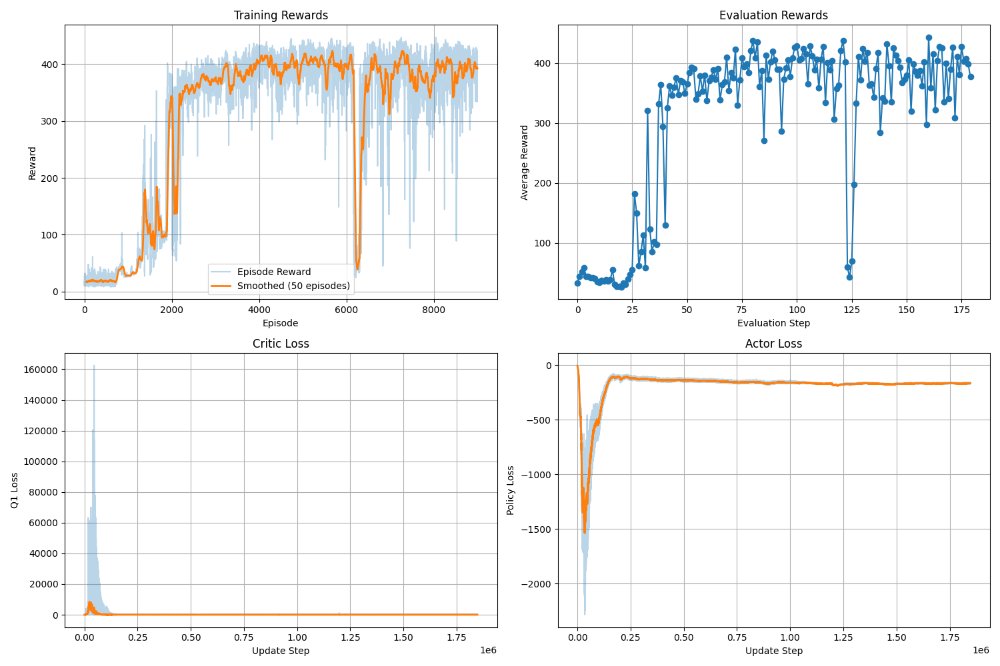
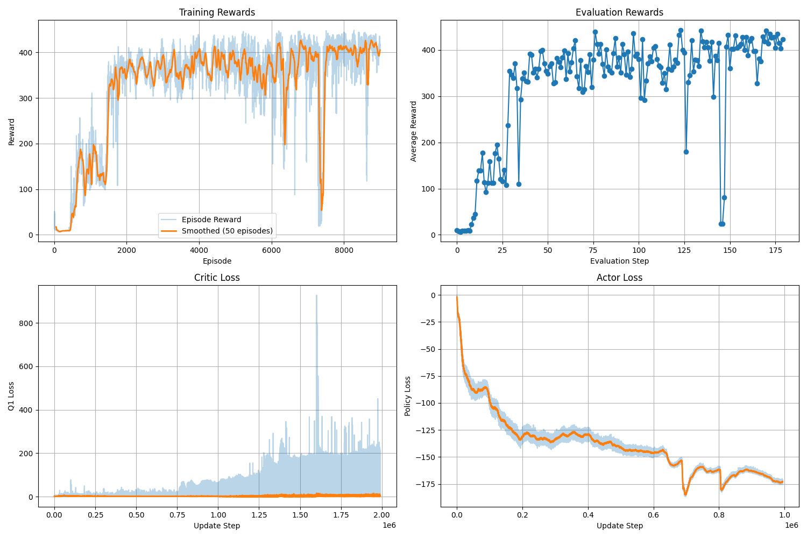
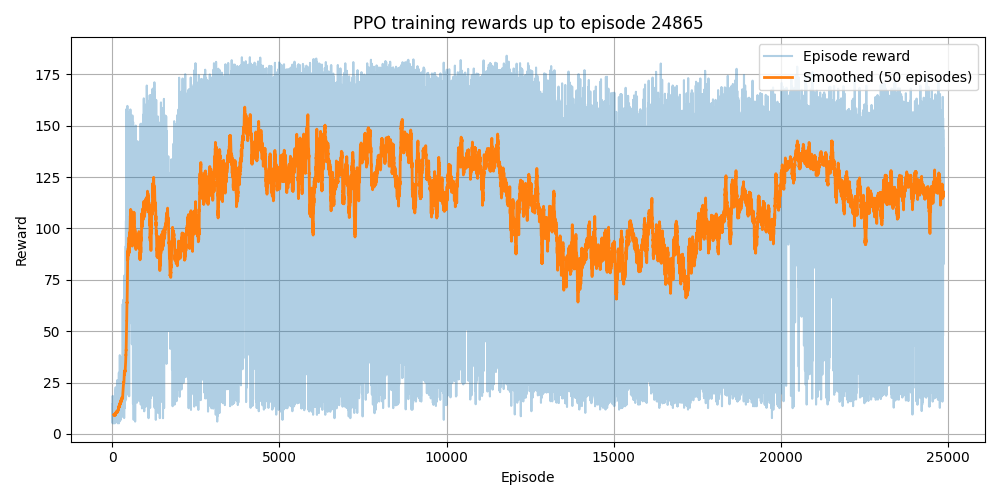
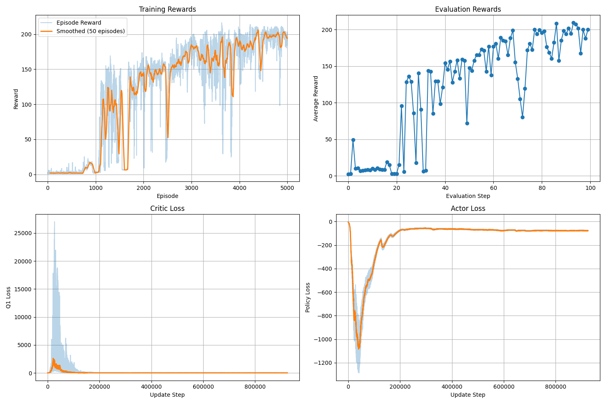
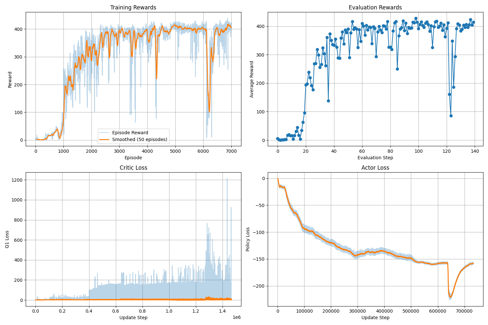
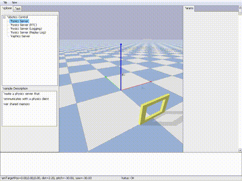
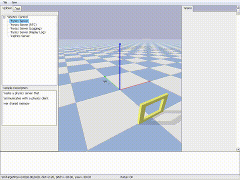
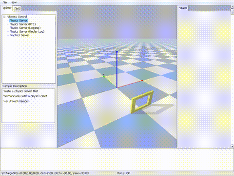

# Learning Agile Quadrotor Flight: ​Narrow-Gate Passing 

- Benchmark SAC / TD3 / PPO under sparse reward vs. reward shaping, with/without curriculum learning.
- Objective: Reliable gate passage → terminal region, measured by success rate, completion time, and stability.

## **1. Participants**
- Dinh Ngoc Tuan, 291184
- Nguyen Thai Son, 291124

## **2. Summary Results (TD3 vs SAC)**

**Evaluation setup.** For each algorithm (TD3, SAC), we ran **10 test episodes** under **identical initial conditions** (same spawn point) and report the metrics for **Reward Shaping (RS)** and **RS + Curriculum Learning (RS+CC)** in the table below.

| Algorithm | Avg reward (RS) | Avg reward (RS+CC) | Success rate (RS) | Success rate (RS+CC) | Avg center-pass time (RS) | Avg center-pass time (RS+CC) |
|---|---:|---:|---:|---:|---:|---:|
| TD3 | 206.72 | 154.42 | 100% | 100% | 3.83 | **2.07** |
| SAC | 187.42 | **210.28** | 100% | 100% | 4.00 | 5.10 |


Testing on **10 episodes** with an **identical spawn point** shows that **Reward Shaping + Curriculum Learning (RS+CC)** enables **TD3** to achieve the fastest completion time (**2.07s**). In contrast, for **SAC**, RS+CC increases the completion time (from **4.00s** to **5.10s**). Nevertheless, we observed qualitatively that curriculum can produce **smoother, less oscillatory behaviors**, indicating a potential trade-off between **speed** and **control smoothness**. This indicates that combining **Curriculum Learning** with **Reward Shaping** is **algorithm-dependent** and does not necessarily improve every metric at final evaluation. However, during training we observed that **RS+CC accelerates learning by ~2×**, which **reduces computational cost** and speeds up iteration. Note that these conclusions are based on **10 episodes** and a **single fixed initial condition**; evaluating across more seeds/initializations would provide stronger evidence.

## **3. Description of the Conducted Research**
- **Problem formulation:** State-based narrow-gate navigation (no vision) with direct RPM control.  
- **Reward design:** Sparse success reward with dense shaping terms. 
- **Curriculum design:** Reverse curriculum (difficulty scheduling) to gradually expand the initial-state distribution.  
- **Ablation evidence:** Compare shaping vs. shaping + curriculum → improved sample efficiency (earlier performance gains) and more stable training. 
- **Algorithm comparison:** Off-policy methods (TD3, SAC) achieve better stability and final performance than PPO in narrow-space navigation.

### New reward function

Flag through gate:

$$
c_t =
\begin{cases}
1, & \lVert p_t - p_g \rVert < \varepsilon \\
c_{t-1}, & \text{otherwise}
\end{cases}
$$

Reward function:

$$
r_t =
\begin{cases}
10, & \big(\lVert p_t - p_f \rVert < \varepsilon\big)\ \land\ (c_t = 1) \\
\max\left(0,\ 1 - \left\lVert p_t - p_{\mathrm{ref}}(\tau_t)\right\rVert\right), & \text{otherwise}
\end{cases}
$$


## **4. Installation and Deployment**
+ OS: Ubuntu 22.04 / 24.04 (recommended)
+ Python: >= 3.10
+ Simulator: PyBullet (via gym-pybullet-drones)
+ - Hardware: CPU works; GPU optional for faster training

> Notes: Training can run headless (no GUI) for speed.
Step-by-step Setup From Scratch:
1. Clone the repository
```
git clone git@github.com:TuanRobotics/Drone_RL_Control.git
cd Drone_RL_Control
```
2. Create a virtual environment
```
python3 -m venv env
source env/bin/activate
pip install --upgrade pip
pip install -r requirements.txt
pip install -e .
```
3. Command for training and testing
Run training with the desired algorithm:
```
cd src
python3 train_thrugate_ppo.py
python3 train_thrugate_sac.py
python3 train_thrugate_td3.py
```
Training with curriculum learning:
```
python3 train_thrugate_sac_curriculum.py
python3 train_thrugate_td3_curriculum.py
```
Testing / Evaluation
Testing supports PPO / SAC / TD3 via the <METHOD> placeholder:
```
python3 test_thrugate_<METHOD>.py --model_path <PATH_TO_MODEL> --use_curriculum <True|False>
```
Example: 
```
python3 test_thrugate_td3.py --model_path  ./log_dir/td3_training_thrugate_curriculum/td3_20251217_161813/td3_model_ep5000.pt --curriculum True 
```

## **5. Demo Key Results**
This section summarizes the main training outcomes for the Go-Through Narrow Space task. We report results for PPO, TD3, SAC under the same environment settings, and additionally evaluate TD3 + Curriculum Learning and SAC + Curriculum Learning to measure how curriculum improves stability and time training. Qualitative results (GIF/videos) and quantitative plots (reward curves, success rate, episode length, etc.) are provided below.

| SAC | TD3 | PPO |
|---:|---:|---:|
| |  |  |

| SAC + Curriculum | TD3 + Curriculum |
|---:|---:|
|  |  |

| SAC | TD3 | PPO |
|---:|---:|---:|
| [](./videos/demo1.mp4) | [](./videos/demo2.mp4) | [](./videos/demo3.mp4) |


| SAC Curriculum | TD3 Curriculum |
|---:|---:|
| [](./videos/demo1.mp4) | [](./videos/demo2.mp4)

### **6. Project Structure**

```text
DRONE_RL_CONTROL/
├── agents/              # RL algorithms (TD3, SAC, PPO), training/evaluation loops, replay buffer, utils
├── architectures/       # Neural network architectures (Actor/Critic, MLP configs, normalization, etc.) - Not use
├── docs/                # Additional documentations
├── gym_pybullet_drones/ # Local fork / wrapper of gym-pybullet-drones (env base, physics, assets)
├── log_dir/             # Training logs, checkpoints
├── notebooks/           # Analysis notebooks, for testing env
├── src/                 # Main entry scripts (train/test), custom environments (FlyThruGateAviary), reward & curriculum, testing results
├── venv/                # Local virtual environment
├── .github/             # CI/configs (workflows, templates)
├── .gitignore           # Git ignore rules
├── CITATION.cff         # Citation metadata for referencing this project
├── LICENSE              # License information
├── pyproject.toml       # Project configuration (packaging, formatting, dependencies if used)
├── README.md            # Project overview and usage
└── requirements.txt     # Python dependencies (pip install -r requirements.txt)
```

### **7. References**

[1] Panerati et al., “Learning to Fly—A Gym Environment with PyBullet Physics”, arXiv 2021

[2] W. Xin, Y. Chen, and W. Zhu, “A Survey on Curriculum Learning,” IEEE Transactions on Pattern Analysis and Machine Intelligence, vol. 44, no. 9, pp. 4555–4576, 2022, doi: 10.1109/TPAMI.2021.3069908​

[3] D. Falanga, E. Müggler, M. Fässler, and D. Scaramuzza, “Aggressive quadrotor flight through narrow gaps with onboard sensing and computing using active vision,” in Proc. 2017 IEEE Int. Conf. on Robotics and Automation (ICRA), Singapore, 2017, pp. 1–8, doi: 10.1109/ICRA.2017.7989679.

[4] J. Schulman, F. Wolski, P. Dhariwal, A. Radford, and O. Klimov, “Proximal Policy Optimization Algorithms,” arXiv preprint arXiv:1707.06347, 2017.

[5] T. Haarnoja, A. Zhou, P. Abbeel, and S. Levine, “Soft Actor-Critic: Off-Policy Maximum Entropy Deep Reinforcement Learning with a Stochastic Actor,” in Proc. ICML (PMLR), vol. 80, 2018. (arXiv:1801.01290)

[6] S. Fujimoto, H. van Hoof, and D. Meger, “Addressing Function Approximation Error in Actor-Critic Methods,” in Proc. ICML (PMLR), vol. 80, 2018. (arXiv:1802.09477)

[7] Mathias Bos, Wilm Decre, Jan Swevers, Goele Pipeleers, Multi-stage Optimal Control Problem Formulation for Drone Racing Through Gates and Tunnels, IEEE 17th International Conference on Advanced Motion Control (AMC), 2022

[8] Yunlong Song, Angel Romero, Matthias Mueller, Vladlen Koltun, Davide Scaramuzza, Reaching the Limit in Autonomous Racing: Optimal Control versus Reinforcement Learning, Science Robotics, 2023 (arXiv:2310.10943)