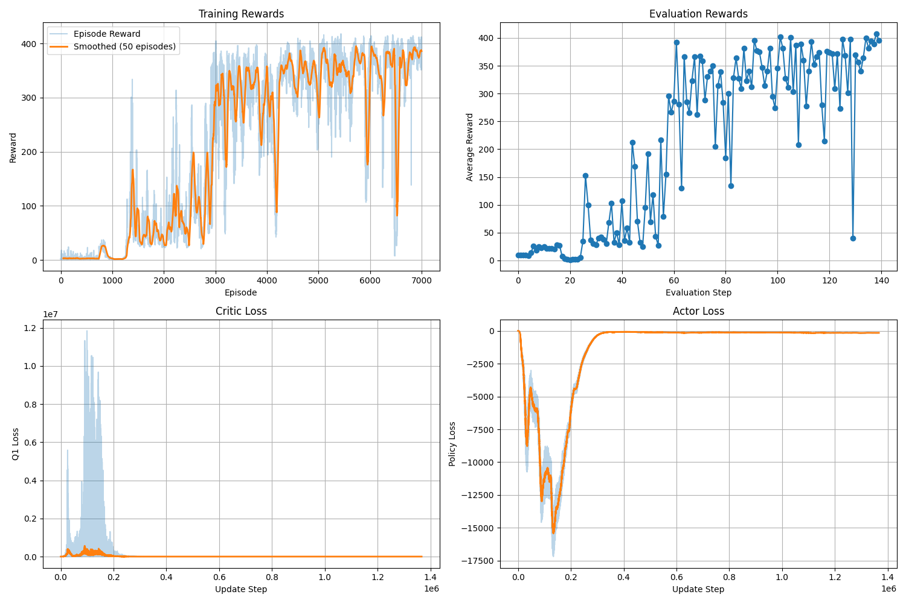

# Learning Agile Quadrotor Flight: ​Narrow-Gate Passing 
- Train SAC/TD3/PPO to fly through a narrow gate using state observations, reward shaping + curriculum learning.
- Goal: Navigate the drone through a narrow gate/space and reach the terminal region reliably.
## Participants
- Dinh Ngoc Tuan, 291184
- Nguyen Thai Son, 291124

## **Description of the Conducted Research**
- Very important

## Installation and Deployment
+ OS: Ubuntu 22.04 / 24.04 (recommended)
+ Python: >= 3.10
+ Simulator: PyBullet (via gym-pybullet-drones)
+ GPU: RTX5060 8GB
> Notes: Training can run headless (no GUI) for speed.
Step-by-step Setup From Scratch:
1. Clone the repository
```
git clone git@github.com:TuanRobotics/Drone_RL_Control.git
cd Drone_RL_Control
pip install -e .
```
2. Create a virtual environment
```
python3 -m venv .venv
source .venv/bin/activate
pip install -r requirements.txt
```
3. Command for training and testing
Run training with the desired algorithm:
```
cd src
python3 train_thrugate_ppo.py
python3 train_thrugate_sac.py
python3 train_thrugate_td3.py
```
Training with curriculum learning:
```
python3 train_thrugate_sac_curriculum.py
python3 train_thrugate_td3_curriculum.py
```
Testing / Evaluation
Testing supports PPO / SAC / TD3 via the <METHOD> placeholder:
```
python3 test_thrugate_<METHOD>.py --model_path <PATH_TO_MODEL> --use_curriculum <True|False>
```


## Demo Key Results
This section summarizes the main training outcomes for the Go-Through Narrow Space task. We report results for PPO, TD3, SAC under the same environment settings, and additionally evaluate TD3 + Curriculum Learning and SAC + Curriculum Learning to measure how curriculum improves stability and time training. Qualitative results (GIF/videos) and quantitative plots (reward curves, success rate, episode length, etc.) are provided below.

| SAC | TD3 | PPO |
|---:|---:|---:|
| |  |  |

| SAC + Curriculum | TD3 + Curriculum |
|---:|---:|
|  |  |

| SAC | TD3 | PPO |
|---:|---:|---:|
| [](./videos/demo1.mp4) | [](./videos/demo2.mp4) | [](./videos/demo3.mp4) |


### Summary Table

| Method | Curriculum | Best Success Rate (Eval) | Avg. Return (Eval) | Stability (Qual.) | Notes |
|:------|:----------:|:------------------------:|:------------------:|:-----------------:|:------|
| PPO   | No         | XX%                      | XX                 | Medium            | Fast training; can be sensitive to reward shaping |
| TD3   | No         | XX%                      | XX                 | Medium–High        | Strong continuous-control baseline |
| SAC   | No         | XX%                      | XX                 | High              | Robust exploration, stable learning curves |
| TD3   | Yes        | XX%                      | XX                 | High              | Curriculum improves convergence & success consistency |
| SAC   | Yes        | XX%                      | XX                 | Very High         | Best overall reliability under domain randomization |

2.2. Project Structure

<!-- ## 5. Environment & Task Design
### 5.1 Simulator/Framework
+ gym-pybullet-drones version, PyBullet, Python version
+ Observation type (kin), Action type (rpm)

### State/Observation Space
- `p = (x, y, z)` : drone position (3)
- `v = (vx, vy, vz)` : linear velocity (3)
- `rpy = (roll, pitch, yaw)` : attitude (3)
- `ω = (wx, wy, wz)` : angular velocity (3)
- `Δp_gate = p - p_gate_center` : relative position to gate center (3)
- `g_ori` : gate orientation encoding (4)  ← (example: quaternion or normal+yaw)
Total: 3 + 3 + 3 + 3 + 3 + 4 = **19**


### Action Space
+ Action Space: RPM
+ Saturation: [-1,1]
### Success / Termination
+ Termination: collision / out-of-bounds / time limit / success
+ Success Metric: episode marked as success when drone passes the gate center region and reaches the final target within a tolerance. -->

